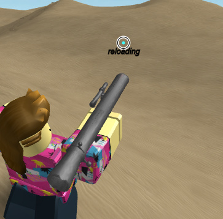
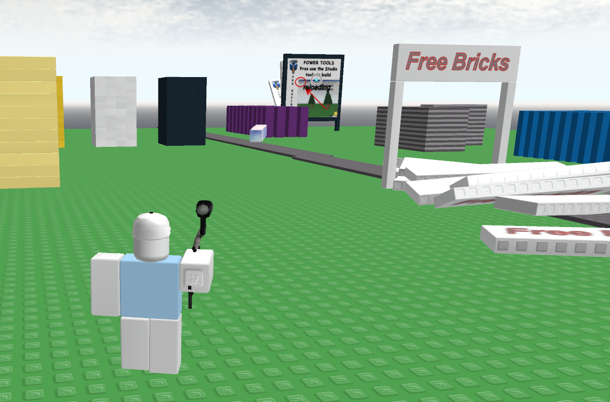
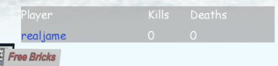
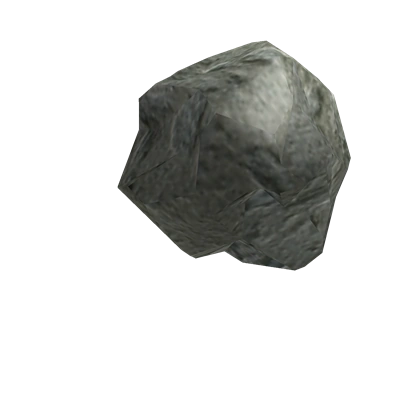
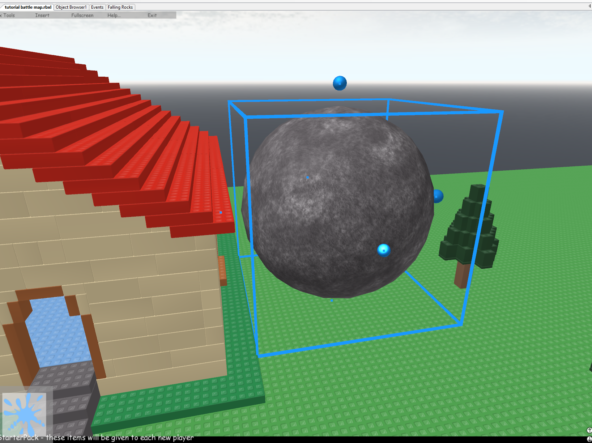

A tutorial on making a game in the 2009 Roblox engine from scratch. It's the script draft for a video I plan to make.

<!--more-->


## Author's note

As mentioned, this is meant to go along with a video where I make commentary *along the lines of* this script and make the game in Roblox Studio.

I wrote this draft a few weeks ago because I wanted to make one big video where you make a game from start to finish. It's scripting focused, mainly for people who already have basic programming knowledge. If you have modern Roblox experience, even better. So part of the tutorial's goal is also to highlight where the old Roblox development process differs - how Studio is used, unique limitations, and the subtle scripting differences.

I basically made it up as I went, I tried making something in Studio and noting down what I did to reach that point, as well as the rationale behind it.

There are some TODOs, notes to myself for what to alter, etc. The non-screenshot images are just placeholders. With that said, I want to publish this now in case I never make the video, or if it takes a while, or something. Because this is still a full guide that can be used for reference.

When I release the tutorial video, I'll make a new post and link to it here.

Happy dev-ing!

## Welcome

Old versions of Roblox are awesome, say what you will about nostalgia. But it's awesome.

And you can still play them! We have versions of the game as old as 2007 archived.

Novetus is a launcher designed to play these games in a more **decentralized** form - you can host old Roblox maps on your own computer, where other people can join from your IP or domain. There's no central server or community to deal with. (Think of it like Minecraft: Java Edition servers!)

Novetus also comes with a lot of old maps and games preinstalled. With just Novetus, you can play the classics either by yourself or with friends, for free!

But it comes with Studio, too. **Novetus gives you the tools to make your own maps and games.**

That's what this course teaches you to do! We'll use the late 2009 version of Roblox Studio to make a battle game, we'll make a weapon from scratch as well as random events that will occur.

This is what the final product looks like, basically.

[](https://wetdry.world/@jame/112662813430498563)

## Getting started

By the way, this tutorial will mostly be scripting.

You can make a lot without any scripting knowledge - by building and using assets like weapons from a variety of games. But this tutorial will focus on general game-making and scripting, not building.
You should have basic programming knowledge, but Lua is easy to learn. The Lua scripting in old Roblox is very similar to modern Roblox, so you'll go far with experience in modern Roblox.

### Install Novetus
https://bitl.itch.io/novetus

As of the tutorial, the current stable version is 1.3. That's fine, but I'll be using the latest snapshot, which is based on the upcoming 2.0 release. Either is fine though.

### Install dependencies
Use the Dependency Installer tool built into Novetus to install everything you need. 

- **Visual C++ 2005 Redistributable** to play 2007
- **Visual C++ 2008 Redistributable** to play 2008+
- **.NET Framework 4.5.1** to run the Novetus launcher. (might be a different version for 1.3 stable)
- **DirectX** to play any version

### Other resources
- Roblox Legacy Wiki provides documentation, highly searchable https://rbxlegacy.wiki
- Object Browser in Studio (good for quick lookups to check if something exists)
- Besides that... eh, not really? TODO

## Setting up our place

We'll be using an existing place! You could easily start from scratch, but there's a lot of fun in opening up old places to see how they work, as well as reusing and remixing ideas and assets from the game.

Use **Universal - Happy Home in Robloxia.rbxl** in 2009L Studio. When you open it, save it to the Novetus maps folder as like "LaserBattle.rbxl" or something. Close Studio and reopen it to this rbxl (you'll have to refresh the novetus map list)

Cool, now we can get started!

## What are we making

I'm turning the classic Happy Home map into a battle game! I will add three new game mechanics to the map:
- Make a new weapon from scratch: a laser shooting gun
- Make a leaderboard system for kills and deaths
- Make a system that causes random events to occur at times (think Survive the Disasters)

## Start with cleanup

Happy Home comes with building tools by default. You can see that because the tool HUD appears for tools you'll spawn in with. We don't need these.

Roblox provides the **StarterPack** object as a container for all the tools players should spawn in with. So we'll open that in the **Explorer** window, which shows all the game objects, and delete the 3. (You can also move them to Lighting for storage, we'll get into that later.)

That's all you need to do.

## New weapon

### Setup
The first thing we'll do is make a new weapon, it shoots lasers and stuff.

Here's what we'll do, instead of setting up the tool and handle from scratch. Open up **Universal - Ultimate Paintball.rbxl** and take the Paintball Gun tool. Copy and paste it into our StarterPack.

Now we have a paintball gun, but we don't want it to be a paintball gun. Go ahead and delete all the stuff inside of it, leaving only a handle. And rename the tool to "Laser Gun" or whatever you want.

### Gun script
Now! Create a script.
TODO guide through this split it up
**remove the target mentions we should introduce it afterwards**

```lua
local tool = script.Parent

local function fire(character, targetPos)
	tool.Handle.Fire:Play()
end

local function onActivated()
	if not tool.Enabled then
		--the Enabled property doesn't really do anything on its own, but its good for scripting here.
		--instead of a variable, so other scripts could be aware (we'll be making a separate LocalScript for mouse icons)
		return
	end
	local character = tool.Parent
	local humanoid = character.Humanoid --error checking would be good but oh well

	local targetPos = humanoid.TargetPoint

	fire(character, targetPos)
end

tool.Activated:connect(onActivated)
```

Cool, now you have a thing that makes a sound when you click. So what do we have to do to make the weapon? **Simply have the fire function create a part that acts as the laser**. Let's go do that!

```lua
local Debris = game:GetService("Debris")

local tool = script.Parent

local function fire(character, targetPos)
	tool.Handle.Fire:Play()
	local laser = Instance.new("Part")
	
	--set laser properties
	laser.Name = "Laser"
	laser.BrickColor = character.Torso.BrickColor
	laser.Transparency = 0.5
	laser.Reflectance = 1
	laser.formFactor = Enum.FormFactor.Symmetric
	laser.Size = Vector3.new(1, 1, 4)
	laser.CanCollide = false

	--NOTE: to make the laser spawn in a smarter way? learn from the paintballshooter script: look at `spawnPos  = spawnPos + (v * 8)`
	local spawnPos = character.Head.Position
	laser.Position = spawnPos
	
	laserScriptClone = tool.LaserScript:Clone()
	laserScriptClone.Parent = laser

	laser.Parent = workspace
	Debris:AddItem(laser, 3) --just in case
end

-- everything below onactivated is the same
```

Oops, and it errors. We forgot to add the script for the laser. Even though it does nothing, add it and test the game again.

Well, it's not going anywhere. Let's try tweaking it live in Play Solo! Open Workspace, go to the gunscript and start editing. We'll test out adding velocity.

```lua
local spawnPos = character.Head.Position --+ Vector3.new(0, 2, 0)
laser.Position = spawnPos
--add this line:
laser.Velocity = (targetPos - spawnPos).unit * 150 --TODO explain this
```

Reload the script by cutting and pasting it back into the same spot. (Toggling Disabled doesn't work for most cases, so this is more reliable either way)

This is getting kind of interesting. Let's make it stronger, and make it face the right way (lol)
Tweak the velocity multiplier until it's more laser-like in power and angle.
300 is better, 600 but at long distances it still has an unusual curve. Let's try 2000! Too fast, how about 1000.

Now we'll make it face the right way every time.
Refactor the code like this, making the direction Vector3 its own variable so we can use it twice:
```lua
	local spawnPos = character.Head.Position
	--swap the rest of the paragraph with this below:
	local direction = (targetPos - spawnPos).unit
	laser.Velocity = direction * 1000
	laser.CFrame = CFrame.new(spawnPos, spawnPos + direction)
```

This is very cool so far!

Last thing, and optional: we'll change the sound effect to sound more laser-y. Pulling assets from online, especially Roblox's websites, is a whole can of worms, but in Novetus, all the local assets are in one place! We'll find a sound to use from a folder called "shareddata" in the Novetus folder. Specifically the sounds subdirectory.

There's a lot of sounds, but I'll be using `13775466.wav`, this one is very laser-y. But you can dig through all the sounds, these are the ones used in gears and such. (Try `11944350.wav` it's funny)

Replace the URL ID of the paintball sound with this: `rbxasset://../../../shareddata/sounds/13775466.wav`

And now, we shall make the laser interactive!

### Laser script
Go to the LaserScript and get going. It'll be pretty simple.

This will be placed in the laser immediately, all it will do is handle what happens if it hits something. My idea for this laser is:

- If it hits a player, damage them.
- If it hits any other part, clone the part. (Why? Why not)
- Either way, delete the laser when it hits anything.

```lua
local laser = script.Parent

local function onTouch(hit)
	--TODO: laser behavior

	laser:Remove()
end

laser.Touched:connect(onTouch)
```
Well, we know it works now. We can see the laser immediately delete when it touches something, rather than go through walls.
Also, it immediately deletes. wtf? Because it spawns inside the head, and that's a part. Go fix that by sticking in a humble wait. 

We could design a more elegant solution, like say, checking if it's the shooter's head, but this works doesn't it?

...this still doesn't work. Ah, because there's more parts than just the head it'll go through, right? My hat is a part, as well as the tool, and my other limbs.
We *could* make the wait longer, but what if we're trying to shoot someone or something super close by? The laser will still be waiting while it goes right through our target!

I guess in the end, we'll have to make a smarter solution.

But making a big if statement, like "if head, if tool, if hat" no, this will take forever (and won't even be able to account for all the possible accessories on a player.) We'll use the handy IsDescendant to just restrict anything that is a descendant of our character.

But... how do we know which character is ours? Remember, we're putting the laser in Workspace. How can it know who shot out this laser?

Let's go with the easiest solution, and one we'll need later: an ObjectValue pointing to the player. (Not the character. Because it'll be more convienent for later.)

Let's go back to the GunScript and set this up. It's easy. (Also while we're at it, let's make the laser script Disabled by default so it doesn't trigger when the player loads and cause an error because it's not in a laser. We'll have the gunscript enable it while being cloned.)

```lua
	laserScriptClone.Parent = laser
	--add below as a new paragraph
	local owner = Instance.new("ObjectValue")
	owner.Name = "Owner"
	owner.Value = Players:GetPlayerFromCharacter(character)
	owner.Parent = laser
```

Good, now we can reference it from our LaserScript.

```lua
--make sure to remove the wait, we no longer need it!
local laser = script.Parent
local owner = laser.Owner

local function onTouch(hit)
	if hit:IsDescendantOf(owner.Value.Character) then
		return
	end

	--TODO: laser behavior

	laser:Remove()
end

laser.Touched:connect(onTouch)
```

Not really interesting so far, but it works. We can now implement the laser behavior!

```lua
local laser = script.Parent
local owner = laser.Owner

local function onTouch(hit)
	if hit:IsDescendantOf(owner.Value.Character) then
		return
	end

	if hit.Parent:FindFirstChild("Humanoid") then
		--i decided to check for humanoid without also checking if its a player (using GetPlayerFromCharacter)
		--this means the laser can damage NPCs too.
		hit.Parent.Humanoid:TakeDamage(20)
	elseif hit:IsA("BasePart") and not hit.Anchored and not hit.Locked then
		--TODO: play a sound
		local partClone = hit:Clone()
		partClone.Parent = workspace
		partClone.Position = hit.Position --will move it on top of the original part
	end

	laser:Remove()
end

laser.Touched:connect(onTouch)
```

Well here's something bad that can happen, if you fire too fast (or say, 2 lasers from different players collide) it gets into a feedback loop of copying itself, including the laser script so it goes on for a long time if not forever and lags the game! Let's fix that by checking if the part's name is "Laser".

```lua
local function onTouch(hit)
	if hit.Name == "Laser" or hit:IsDescendantOf(owner.Value.Character) then
		return
	end
```
Simple as that.

We will also add a cooldown, which will also help prevent this problem and prevent people from spamming it. There's a reason we check if the tool is Enabled in GunScript.
```lua
	fire(character, targetPos)
	tool.Enabled = false
	wait(0.3)
	tool.Enabled = true
end
```

### Mouse icon script
The last part of making the laser! Let's add the classic cursor icons to let the player know if the tool is ready to fire or is on cooldown.



Create a LocalScript, call it something like MouseIcons.

This does the trick:
```lua
local tool = script.Parent

local icons = {
	CanUse = "rbxasset://textures/GunCursor.png",
	OnCooldown = "rbxasset://textures/GunWaitCursor.png"
}

local mouse

local function updateIcon()
	if not mouse then
		return
	end

	if tool.Enabled then
		mouse.Icon = icons.CanUse
	else
		mouse.Icon = icons.OnCooldown
	end
end

local function onPropertyChanged(propertyName)
	if not mouse or propertyName ~= "Enabled" then
		return
	end

	updateIcon()
end

local function onEquip(newMouse)
	mouse = newMouse
	updateIcon()
end

tool.Changed:connect(onPropertyChanged)
tool.Equipped:connect(onEquip)
```



## Leaderboard
### Leaderboard setup
Let's add a leaderboard so players can keep track of their kills and deaths.

In Workspace, make a new script and call it Leaderboard or whatever you want! This will be pretty simple to set up, but it has to be done in a specific way!

```lua
local Players = game:GetService("Players")

local function SetupLeaderboard(player)
	local leaderstats = Instance.new("Model")
	leaderstats.Name = "leaderstats"
	
	local kills = Instance.new("IntValue")
	kills.Name = "KOs"
	kills.Parent = leaderstats

	local deaths = Instance.new("IntValue")
	deaths.Name = "WOs"
	deaths.Parent = leaderstats

	leaderstats.Parent = player
end

Players.PlayerAdded:connect(SetupLeaderboard)

--For play solo debug!
wait(2)
if Players:FindFirstChild("realjame") and not Players.realjame:FindFirstChild("leaderstats") then
	SetupLeaderboard(Players.realjame)
end

```



Good, but it doesn't update. Let's code in the behavior for that. 

### Updating deaths

First, deaths, because we can manage that here in the leaderboards script.

```lua
local function CharacterAdded(character, player, deaths)
	character.Humanoid.Died:connect(function()
		deaths.Value = deaths.Value + 1
	end)
end

local function SetupLeaderboard(player)
	local leaderstats = Instance.new("Model")
	leaderstats.Name = "leaderstats"
	
	local kills = Instance.new("IntValue")
	kills.Name = "KOs"
	kills.Parent = leaderstats

	local deaths = Instance.new("IntValue")
	deaths.Name = "WOs"
	deaths.Parent = leaderstats

	leaderstats.Parent = player

	player.CharacterAdded:connect(function(character)
		CharacterAdded(character, player, deaths)
	end)
	CharacterAdded(player.Character, player, deaths) --for the first time
end
```
### Updating kills
Head back to the LaserScript, we'll update kills there. After all, the laser script knows who fired a laser and handles damaging a player, so it'll be easy to check if the player died and update the shooter's kills value accordingly.

```lua
		hit.Parent.Humanoid:TakeDamage(20)

		if hit.Parent.Humanoid.Health <= 0 then
			local kills = owner.Value.leaderstats.KOs
			kills.Value = kills.Value + 1
		end
```
4 lines, it's that simple!

### Now what?
You could stop here.
There's a lot of possibilities:

- Add more weapons (make more from scratch, or use existing ones like brickbattle tools)
- Add more to the map, or even code it to be a round-based game that cycles maps.
- Decorate the place: add a day/night cycle, more sound and visual effects to the laser, add music
- Make it a team vs team game
- Add pick-ups: weapons, items, health
- Something entirely unique: alter the movement/gravity of the place, add objectives for players other than killing
## Event system
What we'll do is add random events that will occur every so often. We'll add 2:
- Rocks fall from the sky and can kill players, but you can also clone the rocks with your laser as an attack
- Lasers cause small explosions on hit!

### Event system setup
Create the script in Workspace.
Create the 2 objects we'll use to display text to players for announcements and status text, a Message, and a Hint. You'll have to create the Hint using Instance.new in the command bar for reasons unknown, so if you don't have the command bar, go turn it on in View options! I'll rename them to Overlay and Banner for clarity.

Now, the script. It'll simply be on an infinite loop, waiting for the next event.

```lua
local banner = workspace.Banner
local overlay = workspace.Overlay

--unnecessary but i like doing it
local function ApplyPlural(number)
	if number == 1 then
		return ""
	end
	return "s"
end

while true do
	local eventCooldown = math.random(100, 400)
	for i = eventCooldown, 0, -1 do
		banner.Text = string.format("Next event will start in %d second%s", i, ApplyPlural(i))
		wait(1)
	end
	wait()
end

```
Also, we can finally make use of the Run feature in Studio for testing, so we don't have to open a Play Solo every time. And if you Run, you'll see that it displays a timer to the next event! It doesn't do anything besides that, but it'll be very easy to implement events now.

Let's create placeholder functions for the events, and make it pick at random.
```lua
local banner = workspace.Banner
local overlay = workspace.Overlay

--unnecessary but i like doing it
local function ApplyPlural(number)
	if number == 1 then
		return ""
	end
	return "s"
end

local events = {
	{
		Name = "Falling Rocks",
		Description = "Rocks fall from the sky, don't get hit!"
	},
	{
		Name = "Exploding Lasers",
		Description = "Your lasers will explode on contact!"
	}
}

local lastEvent
local event
local function StartEvent()
	repeat
		event = events[math.random(1, #events)]
	until event ~= lastEvent
	overlay.Text = string.format("The next event will be %s!", event.Name)
	banner.Text = event.Description
	wait(3)
	overlay.Text = ""
	banner.Text = ""

	local eventTime = math.random(60, 100)
	for i = eventTime, 0, -1 do
		banner.Text = string.format("Event ends in %d second%s", i, ApplyPlural(i))
	end
	lastEvent = event
end

while true do
	local eventCooldown = math.random(100, 400)
	for i = eventCooldown, 0, -1 do
		banner.Text = string.format("Next event will start in %d second%s", i, ApplyPlural(i))
		wait(1)
	end
	StartEvent()
	wait()
end
```
The events don't do anything, but our script now picks from a selection. We even add a convenience feature where it'll avoid picking the same event twice in a row.
This is slow to test, let's make the cooldown much shorter for debugging.

```lua
	local eventCooldown = 5 --math.random(100, 400)
```

Alright, here's how we'll implement the event behavior. We'll make scripts for each event, and run them when we need to. Make the scripts as children of Events and name them the names of events, so Falling Rocks and Exploding Lasers.

Let's code in Falling Rocks:

```lua
local Lighting = game:GetService("Lighting")

local rock = Lighting.Rock
local baseplate = workspace.Base --we'll drop rocks randomly on this part

local function SpawnRock()
	local rockClone = rock:Clone()

	local spawnPos = baseplate.Position
	local spawnSize = baseplate.Size
	local offsetX = spawnSize.X / 2
	local offsetZ = spawnSize.Z / 2

	rockClone.Position = Vector3.new(
		math.random(spawnPos.X - offsetX, spawnPos.X + offsetX),
		200,
		math.random(spawnPos.Z - offsetZ, spawnPos.Z + offsetZ)
	)

	local rockScriptClone = script.RockScript:Clone()
	rockScriptClone.Disabled = false
	rockScriptClone.Parent = rock

	rockClone.Parent = workspace
end

while true do
	SpawnRock()
	wait(1)
end
```

As for the rock script:
```lua
local Debris = game:GetService("Debris")

local rock = script.Parent

Debris:AddItem(rock, 20)

rock.Touched:connect(function(hit)
	if hit.Parent and hit.Parent:FindFirstChild("Humanoid") then
		hit.Parent.Humanoid:TakeDamage(20)
	end
end)
```
*Why are we making a dedicated script for individual rocks?* Because when the event script is removed, the event for damaging players is gone. Also, rocks cloned by the laser would not damage players because they wouldn't have an event listener.

And we'll make the rock too! This time, we'll make it in advance rather than have a script create it. Why? Not really any reason, other than to show that the Lighting object can be used as a storage. (In modern Roblox, there are several dedicated storage objects, such as ServerStorage and ServerScriptStorage). 
Storing things in Lighting is very handy for greater things, such as entire maps and minigames.

You could style the rock with a mesh, such as this classic one used in a variety of places.



But for simplicity we'll make ours a simple ball. So make it in Workspace and put it in Lighting.



Of course, we'll update the Events script to run these event scripts.
```lua
local Debris = game:GetService("Debris")

local banner = workspace.Banner
local overlay = workspace.Overlay

--unnecessary but i like doing it
local function ApplyPlural(number)
	if number == 1 then
		return ""
	end
	return "s"
end

local events = {
	{
		Name = "Falling Rocks",
		Description = "Rocks fall from the sky, don't get hit!"
	},
	{
		Name = "Exploding Lasers",
		Description = "Your lasers will explode on contact!"
	}
}

local lastEvent
local event
local function StartEvent()
	repeat
		event = events[math.random(1, #events)]
	until event ~= lastEvent
	overlay.Text = string.format("The next event will be %s!", event.Name)
	banner.Text = event.Description
	wait(3)
	overlay.Text = ""
	banner.Text = ""
	
	--Disabled would be the far more intuitive and simple solution than copying the script, but Roblox 2009 works in mysterious ways.
	scriptClone = script:FindFirstChild(event.Name):Clone()
	scriptClone.Disabled = false
	scriptClone.Parent = workspace

	local eventTime = math.random(60, 100)
	Debris:AddItem(scriptClone, eventTime)
	for i = eventTime, 0, -1 do
		banner.Text = string.format("Event ends in %d second%s", i, ApplyPlural(i))
		wait(1)
	end
	lastEvent = event
end

while true do
	local eventCooldown = 5 --math.random(100, 400)
	for i = eventCooldown, 0, -1 do
		banner.Text = string.format("Next event will start in %d second%s", i, ApplyPlural(i))
		wait(1)
	end
	StartEvent()
	wait()
end


```

Now it works. How about that?
We'll move on to the 2nd event. This one we'll implement with as simple a solution we can get: don't use the event script at all. Let's go back to the LaserScript a 3rd time to implement this behavior. We will actually rely on the event script's existence to check that the event is active, but the script will do nothing. lol

```lua
if hit.Name == "Laser" or hit:IsDescendantOf(owner.Value.Character) then
		return
	end
	--add this paragraph below:
	if workspace:FindFirstChild("Exploding Lasers") then
		local explosion = Instance.new("Explosion")
		explosion.Position = laser.Position
		explosion.BlastRadius = 10
		explosion.BlastPressure = 0.1
		
		explosion.Parent = workspace
	end
	-- ^^^
	if hit.Parent:FindFirstChild("Humanoid") then
```

## Conclusion

This is also an author's note because I didn't write a conclusion to the script, lol.

But that is it! Now you have a game that can be extended in so many ways, and I also hope it inspires you to look deeper into what you can do with this engine, and create something unique.

Have a good day!
